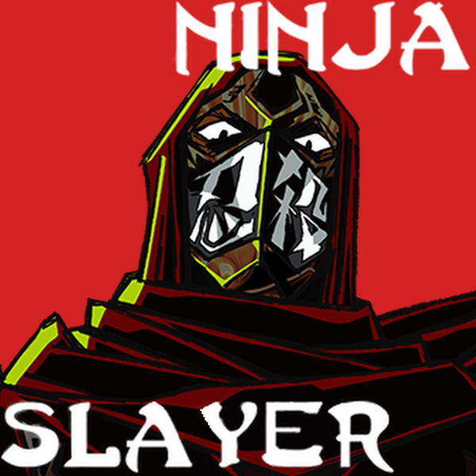

<div align="center">
  
  <h1>忍者杀手 NinjaSlayer</h1>
  <p>《杀戮尖塔 2》的忍者杀手角色 Mod</p>
  <p><strong>简体中文</strong> | <a href="README_EN.md">English</a></p>
  <!-- compatibility-badges:start -->
  <p>
    
    
    
    
    
    <a href="https://github.com/2223M1/NinjaSlayer/releases/latest"></a>
  </p>
  <!-- compatibility-badges:end -->
</div>

NinjaSlayer 将《忍者杀手》的战斗风格带入《杀戮尖塔 2》，围绕空手道、手里剑、茶道、奈落与忍者之魂构建完整的可玩角色体验。项目基于 RitsuLib，包含自定义机制、演出、事件、音频与配套内容。

## 项目特色

- 以连贯的角色机制和多种战斗路线还原忍者杀手主题。
- 包含自定义处决、角色动画、Boss 死亡演出、伙伴表现与 FMOD 音频。
- 为存档、多人游戏、版本契约和 Mod 兼容性设置了明确的防护与验证流程。
- 持续维护独立的[卡牌目录](Docs/card-catalog.md)，首页不重复展开内容清单。

## 安装

### Steam 创意工坊

1. 通过链接订阅 [NinjaSlayer](https://steamcommunity.com/sharedfiles/filedetails/?id=3776911445)；该条目不会出现在公开列表或搜索中，同一个下载包同时支持 stable 和 preview。
2. 订阅并启用 [RitsuLib](https://steamcommunity.com/sharedfiles/filedetails/?id=3747602295)。
3. 启动游戏，在 Mod 管理器中启用 `STS2-RitsuLib` 与 `NinjaSlayer`。

### 手动安装

1. 从 [GitHub Releases](https://github.com/2223M1/NinjaSlayer/releases) 下载最新构建。
2. 将压缩包内容解压到《杀戮尖塔 2》的 `mods` 目录。
3. 单独安装并启用兼容版本的 RitsuLib，然后启用 NinjaSlayer。

## 兼容性与语言

<!-- compatibility:start -->
| 组件 | 支持范围 |
|---|---|
| Slay the Spire 2 | stable 正式版 `0.107.1`；preview 测试版 `0.110.1` |
| RitsuLib | 编译基线与最低依赖 `0.5.1`；Workshop 运行时使用自动更新的最新版 |
| 平台目标 | Windows x64、macOS、Linux x86_64 / Steam Deck；正式跨平台支持须通过六格实机矩阵 |
| .NET | `9.0` |
| Godot | `4.5.1 Mono` |
| 游戏内语言 | 目前主要提供简体中文 |

GitHub Release 提供 stable、preview 两个宿主专用诊断包和一个通用 Workshop 包。Workshop 条目不进入公开列表和搜索，但可通过链接访问并订阅；所有玩家下载同一个包，启动时按游戏宿主精确选择 stable 或 preview 实现。通用 PCK 不携带 Spine 原生扩展，运行时复用官方客户端已经加载的当前平台扩展。当前自动化真实游戏测试仅覆盖 Windows；macOS 与 Linux 的 stable/preview 实机矩阵通过前不宣称已完成正式跨平台验证。
<!-- compatibility:end -->

英文 README 仅用于项目文档与安装说明，不代表游戏内已提供完整英文文本。

## 开发构建

需要 [.NET SDK 9](https://dotnet.microsoft.com/download/dotnet/9.0)、[Godot 4.5.1 Mono](https://godotengine.org/download/archive/4.5.1-stable/)、PowerShell 7（`pwsh`）和对应版本的游戏文件。仓库自动化不支持 Windows PowerShell 5.1。

```powershell
git clone https://github.com/2223M1/NinjaSlayer.git
cd NinjaSlayer
dotnet restore .\NinjaSlayer.csproj
dotnet build .\NinjaSlayer.csproj --no-restore -c Release -v:minimal
```

普通构建不会自动安装或发布 Mod。测试、真实游戏契约、打包、本地安装及发布边界见[开发与发布指南](Docs/development.md)。

## 相关链接

- [Steam 创意工坊（非公开链接）](https://steamcommunity.com/sharedfiles/filedetails/?id=3776911445)
- [GitHub Releases](https://github.com/2223M1/NinjaSlayer/releases)
- [问题反馈](https://github.com/2223M1/NinjaSlayer/issues)
- [卡牌目录](Docs/card-catalog.md)
- [隐私说明](Docs/privacy.md)

## 作者与鸣谢

项目由 [2223M1](https://github.com/2223M1) 维护。

感谢 [RitsuLib](https://github.com/BAKAOLC/STS2-RitsuLib) 的维护者、STS2 Modding 教程与社区参与者提供的框架、文档和技术交流。

## 权利说明

本项目是非官方同人 Mod。《杀戮尖塔 2》、《忍者杀手》及相关名称、角色、美术和其他第三方内容的权利归各自权利人所有。

本仓库未声明开源许可证。源码可公开查看不等于授予复制、修改、再发布或制作衍生版本的许可；如需使用本项目内容，请先取得维护者及相关权利人的明确授权。
