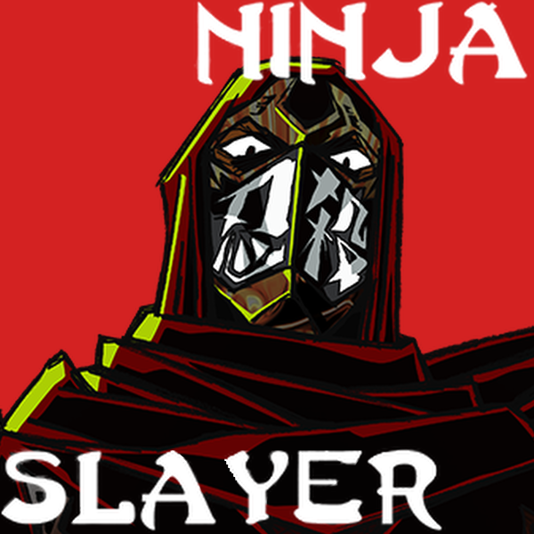

  
  <h1>Ninja Slayer</h1>
  
A character mod for Slay the Spire 2

  
<a href="README.md">简体中文</a> | <strong>English</strong> | <a href="README_JA.md">日本語</a>

  <!-- compatibility-badges:start -->
  

    
    
    
  

  <!-- compatibility-badges:end -->

> "Domo, Spire-san. Ninja Slayer desu."
>
> Greet first, fight second. It is written in the Kojiki.

A salaryman who lost his wife and child is possessed by a mysterious ninja soul, and now he's climbing the Spire. Are there ninjas up there? If there are, none of them are getting away.

## What's inside

- **Karate**: trade blows up close and get better the longer you swing.
- **Shuriken**: keep a stack of throwing stars handy and let them fly at the right moment.
- **Chado**: out of breath? Sip some tea, hiss, huff, and get back in there.
- **Naraku**: borrow Naraku's power and set the Spire burning red and black.
- Along the way you'll meet Yamoto Koki, Nancy Lee, Forest Sawatari, Dark Ninja… some will help, some want a duel.
- Character-specific cards, relics and events, plus animations, greetings and finishers. Want a peek at the cards? The [card catalog](Docs/card-catalog.md) is in Chinese for now.

## Install

1. Subscribe to [Ninja Slayer](https://steamcommunity.com/sharedfiles/filedetails/?id=3776911445) and its required mod, [RitsuLib](https://steamcommunity.com/sharedfiles/filedetails/?id=3747602295).
2. Enable `STS2-RitsuLib` and `NinjaSlayer` in the game's mod manager.
3. Pick Ninja Slayer and start climbing.

The Workshop item doesn't show up in search yet, so use the link above. The stable and beta branches share one download.

The latest version is published on the Workshop. [GitHub Releases](https://github.com/2223M1/NinjaSlayer/releases) keeps historical packages for rollbacks.

0.3.9 supports runs from 0.3.8. Model IDs from before 0.3.8 remain incompatible; finish those runs first. Existing saves and history files are not rewritten or deleted.

## Versions and languages

<!-- compatibility:start -->
- Game stable `0.107.1` and beta `0.111.0`.
- Requires RitsuLib `0.5.12` or later.
- Text is available in Simplified Chinese, English and Japanese, following the game's language setting.
- Tested on Windows. Real-device testing on macOS, Linux and Steam Deck is not yet complete.
<!-- compatibility:end -->

## Something broke?

Press **F2** in game to send me a letter, with a screenshot and logs attached. You can also [open an issue](https://github.com/2223M1/NinjaSlayer/issues). Tell me your game and mod versions and what you did right before, and I'll find the culprit faster.

Curious what everyone picks and where runs fall? Visit [Ninja Slayer Intel](https://2223m1.github.io/NinjaSlayer/?lang=eng). The data comes from players who chose to share; you can turn it off in the mod settings. See the [privacy notice](Docs/privacy.md#english).

## Author

Made by 波比梓狸 ([2223M1](https://github.com/2223M1)) together with a few AI assistants. Thanks to the authors of [RitsuLib](https://github.com/BAKAOLC/STS2-RitsuLib) and everyone who shares tutorials and helps with debugging.

Unofficial fan mod. The code has no open-source license, so please ask before reposting or adapting it.
